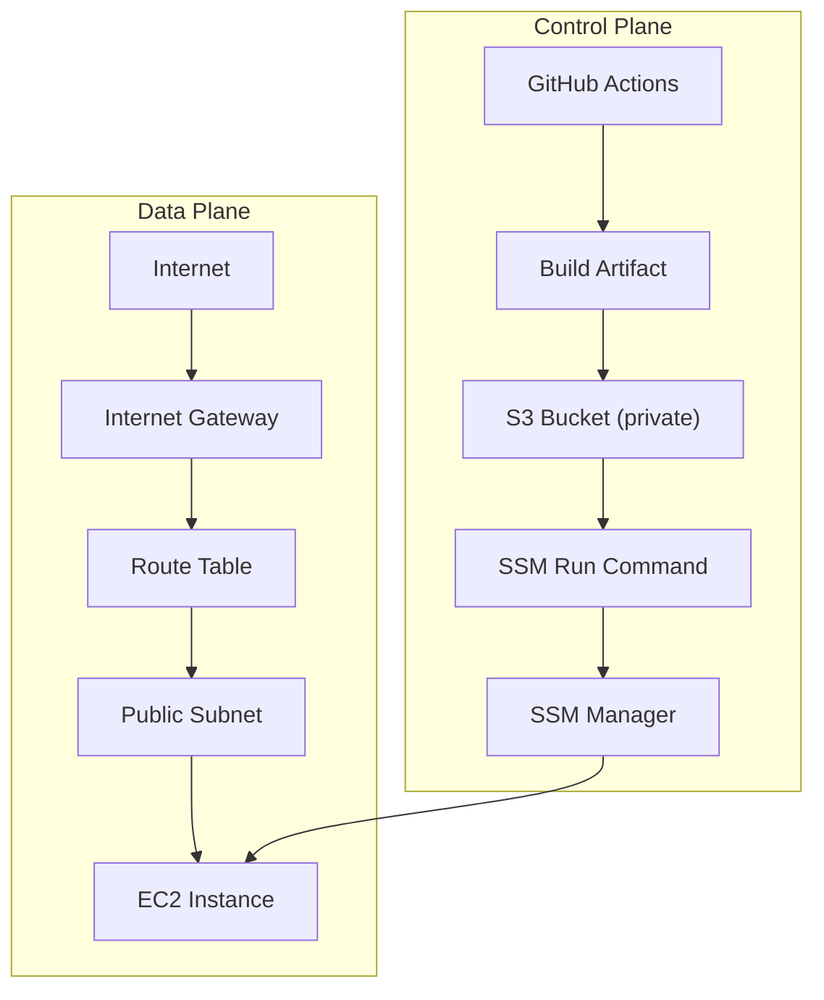

```mermaid
flowchart TB

    subgraph Data ["Data Plane"]
        direction LR
        U["Internet"] --> IGW["Internet Gateway"]
        IGW --> RT["Route Table"]
        RT --> PS["Public Subnet"]
        PS --> EC2["EC2 Instance"]
    end

    subgraph Control ["Control Plane"]
        direction LR
        Git["GitHub Actions"] --> ART["Build Artifact"]
        ART --> PS3["S3 Bucket (private)"]
        PS3 --> GA["SSM Run Command"]
        GA --> SSM["SSM Manager"]
        SSM --> EC2["EC2 Instance"]
    end
```